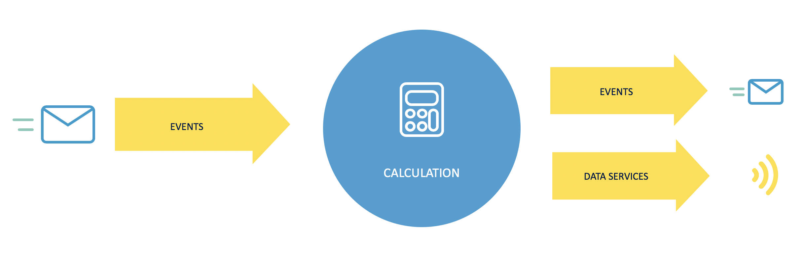
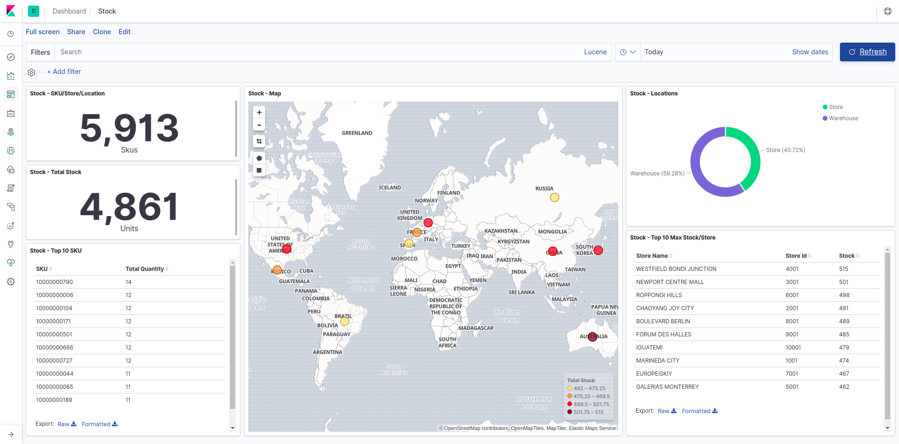

 # NEAR REAL-TIME Demo

**Notes**:
 - *Use "--config core.autocrlf=input" at the end of the git clone command. [More info](https://help.github.com/en/articles/dealing-with-line-endings)*
 - *For Linux, run the following command before the first deploy of elasticsearch:*

        sysctl -w vm.max_map_count=262144

## Overview

Demo of stock management with a kappa architecture approach:

### Data Flow

### Data Visualization

Stock event processing flow design:

- Change events source with items movements
- Processing events to calculate the aggregate
- Propagation of events and data services

## Build

### Prerequisites

You need to have the following tools installed:

- Docker V18.09 or later
- Maven V3.6.1 or later
- Apache Jmeter 5.1.0 or later

### Oracle Docker Images

You need to have the following Docker images:

- oracle/serverjre:8
- oracle/coherence:12.2.1.3.0-standalone

For build the images download the repository from [GitHub](https://github.com/oracle/docker-images)

Then follow the README.md steps of the following directories:

- OracleJava
- OracleCoherence

### Oracle Maven Repository

Some dependencies needs a special maven configuration [Oracle Documentation](https://docs.oracle.com/middleware/1213/core/MAVEN/config_maven_repo.htm#MAVEN9015)

### Compile & Build Images

Run compile.sh for the following directories:

- common
- coherence
- springboot/dataservice
- springboot/processor    
    
Run build.sh for the following directories:

- elk/logstash/movements
- elk/logstash/stock
- kafka/ksql-headless

## Usage

### Create docker network

Containers are connected to jbcm-net (docker bridge network)

	docker network create jbcn-net

### Deployment & Configuration

    docker-compose -f docker-compose-1.yml up -d

    bash kafka/broker/configureTopics.sh

    bash elk/elasticsearch/createMappings.sh

    bash elk/kibana/createDashboards.sh

    docker-compose -f docker-compose-2.yml up -d

### Jmeter Test

    jmeter -n -t jmeter/Kafka_Locations_Enrich.jmx

    jmeter -n -t jmeter/Kafka_Changes_Test.jmx

    jmeter -n -t jmeter/Kafka_Stock_Test.jmx

### Jmeter Data Ingestion

    jmeter -n -t jmeter/Kafka_Locations_Enrich.jmx

    jmeter -n -t jmeter/Kafka_Data_Ingestion.jmx

### Reset Kafka Offsets

    bash kafka/broker/listGroupConsumers.sh

    bash kafka/broker/resetOffsets.sh $group $topic

### KSQL Console

    docker run --net=jbcn-net -it confluentinc/cp-ksql-cli http://ksql-server:8089

### Stop containers

    docker-compose -f docker-compose-2.yml down
    docker-compose -f docker-compose-1.yml down
